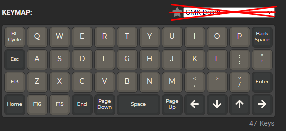

# Planck EZ Glow Macro QMK Build

### Introduction

This is an attempt to apply [TaranVH's 2nd Keyboard Scripts](https://github.com/TaranVH/2nd-keyboard) (check out his LinusTechTips video) to the [QMK firmware](https://docs.qmk.fm/#/) and build it for the Planck EZ Glow keyboard. I volunteered to do this for [Tomshiii](https://github.com/Tomshiii/ahk/tree/main/Secondary%20Keyboard%20Files), whose Twitch  Channel I am a fan of.

Initially, he was hoping to apply Taran's solution of using a programmable dongle (which would run QMK) with a specific numpad, but it wasn't supported. Or something like that. And then he bought the Planck EZ Glow, but the Planck wouldn't work with the dongle, of course. But the Planck EZ Glow (and, indeed, any Planck as of this writing) can run QMK natively. And so, I started a project.

### The Idea and Purpose

Basically, each key (except the top-left-most key) is wrapped in an F24 modifier. Why? Because you can easily use AutoHotKey to turn those into macros.

Essentially, most keyboard shortcuts are going to be used for a variety of applications. In order to make something universal (for stream decks, macro keyboards, etc), most people end up using `CTRL+SHIFT+ALT` together as a modifier for a key. The problem with doing this is that sometimes AutoHotKey (or even other shortcut applications) doesn't recognize the key up events for one or more of those modifiers, resulting in stuck keys as well as broken functionality.

So, why don't we use another key? Well, most operating systems and keyboard firmwares do not treat other keys in a way that you would modifiers - i.e.:

* the key does nothing on its own
* [ pressing it down, _then_ pressing and releasing another key, _then_ releasing it ] is the expected modus operandi
* the key is expected to exist on a normal keyboard

In that vein, Taran created a 2nd Keyboard Script for the QMK firmware that basically pre-pends a key-down event for a specified key (F22 for him, F24 for me) and post-pends a key-up event of that same specified key.

I unashamedly stole that, adjusted it to apply to F24 instead, and built it into the QMK firmware for the Planck EZ Glow Macro, along with a keymap made on the [QMK configurator](https://config.qmk.fm/#/planck/ez/glow/LAYOUT_planck_1x2uC).

### Functionality

If you look at the `planck/keymaps/keymap.c` file, you'll see I've adapted Taran's `process_record_user` and `post_process_record_user` functions to work with F24. Honestly, I don't remember Taran's reason for using F22 instead of F24, but I ignored it for this application and Tomshiii has reported that it works just fine with AutoHotKey.

The keyboard is supposed to glow orange to match his aethetic, and the bottom left key should cycle brightness. This RGB lighting functionality is not currently working and instead it's glowing "rainbow puke." I will continue attempts to fix this. In the interrim, I have it set to turn off the backlight completely.

The keymap is as follows:

It previously was this (and was broken, as a reminder, with the backlight cycling not working):

### To Do

* Add compiled firmwares
  * as a release?
  * add proper branches for each variation
* Fix the gosh darn backlight so it glows orange @ 50% brightness
  * check to make sure EZ Glow uses `RGB_MATRIX`
  * check if using RGB (vs HSV) values works (or vice versa)
* Add documentation
  * Add instructions for flashing MY fw/config/keymap yourself
  * Add instructions for editing the keymap
  * Add instructions for editing the makeshift modifier key
  * Add instructions for building the fw yourself after the above two changes
* Improvements ?? (maybe if I get time and feel like it one day)
  * Add layers
  * Add lighting for different layers
  * Change the makeshift modifier per layer
* Provide some releases with variations
  * Probably good to add some CI/CD to release these post changes